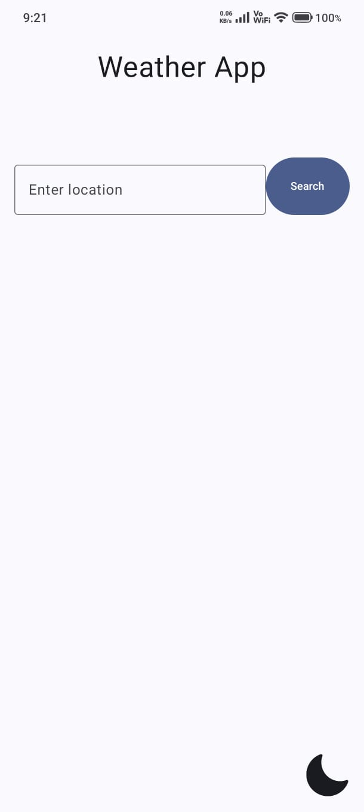
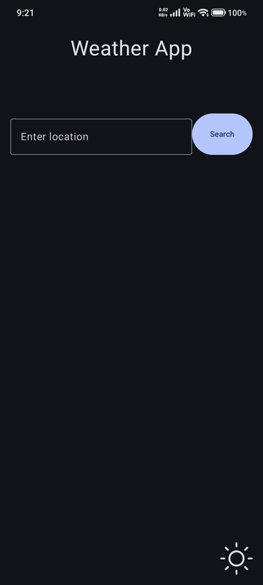

# Weather App

A modern Android Weather App built using Jetpack Compose and MVVM Architecture.

## Features

- Search weather by city
- Real-time weather data
- Weather condition icons
- Error handling
- State management with StateFlow

## Tech Stack

- Kotlin
- Jetpack Compose
- MVVM
- Retrofit
- Coroutines
- StateFlow
- Open-Meteo API

## Architecture

UI → ViewModel → Repository → Retrofit → API

## Screenshots

